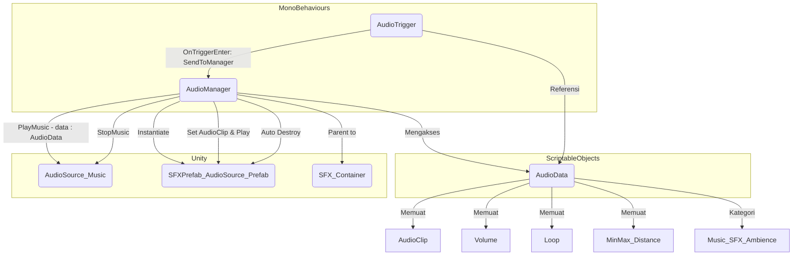

---
category:
  - "[[GameDevelopment]]"
tags:
  - 2025-W18
  - 2025-04-30
  - game_development
created: 2025-04-30 00:25
---

```mermaid
flowchart TD
    %% ScriptableObjects
    subgraph ScriptableObjects
        SO1(AudioData)
    end
    %% MonoBehaviours
    subgraph MonoBehaviours
        MB1(AudioManager)
        MB2(AudioTrigger)
    end
    %% Unity Components & Prefabs
    subgraph Unity
        U1(AudioSource_Music)
        U2(SFXPrefab_AudioSource_Prefab)
        U3(SFX_Container)
    end

    %% Alur Musik
    MB1 -->|PlayMusic - data : AudioData| U1
    MB1 -->|StopMusic| U1

    %% Alur SFX
    MB2 -->|OnTriggerEnter: SendToManager| MB1
    MB1 -->|Instantiate| U2
    MB1 -->|Parent to| U3
    MB1 -->|Set AudioClip & Play| U2
    MB1 -->|Auto Destroy| U2

    %% Data Relationships
    MB1 -->|Mengakses| SO1
    MB2 -->|Referensi| SO1

    %% Info AudioData
    SO1 -->|Memuat| AudioClip
    SO1 -->|Memuat| Volume & Loop & MinMax_Distance
    SO1 -->|Kategori| Music_SFX_Ambience
```