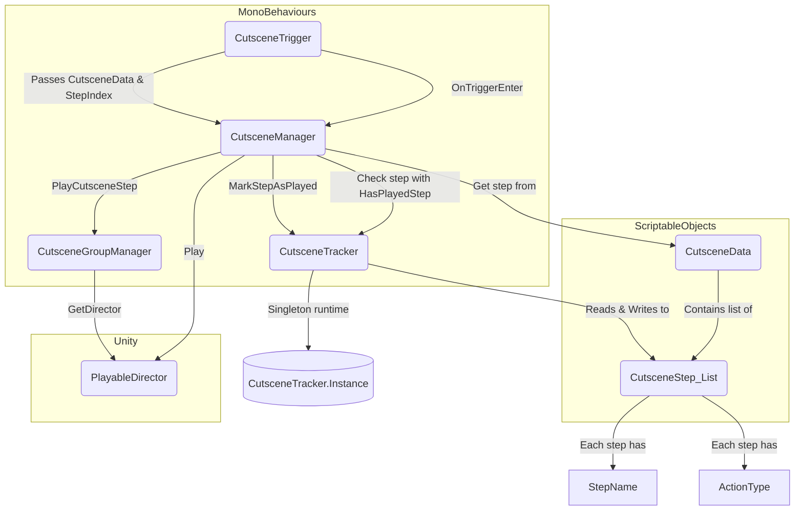

---
category:
  - "[[GameDevelopment]]"
tags:
  - 2025-W18
  - 2025-04-29
  - game_development
created: 2025-04-29 21:03
---

```mermaid
flowchart TD

    %% ScriptableObjects

    subgraph ScriptableObjects

        SO1(CutsceneData)

        SO2(CutsceneStep_List)

    end

  

    %% MonoBehaviour scripts

    subgraph MonoBehaviours

        MB1(CutsceneTrigger)

        MB2(CutsceneManager)

        MB3(CutsceneTracker)

        MB4(CutsceneGroupManager)

    end

  

    %% Unity component

    subgraph Unity

        U1(PlayableDirector)

    end

  

    %% Connections (Flow)

    MB1 -->|OnTriggerEnter| MB2

    MB1 -->|Passes CutsceneData & StepIndex| MB2

  

    MB2 -->|PlayCutsceneStep| MB4

    MB2 -->|Check step with HasPlayedStep| MB3

    MB2 -->|Get step from| SO1

    MB2 -->|MarkStepAsPlayed| MB3

    MB2 -->|Play| U1

  

    MB4 -->|GetDirector | U1

  

    SO1 -->|Contains list of| SO2

    SO2 -->|Each step has| StepName & ActionType

  

    MB3 -->|Reads & Writes to| SO2

    MB3 -->|Singleton runtime| MB3_Instance[(CutsceneTracker.Instance)]
```