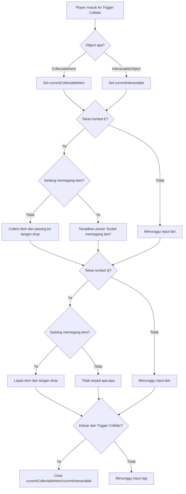
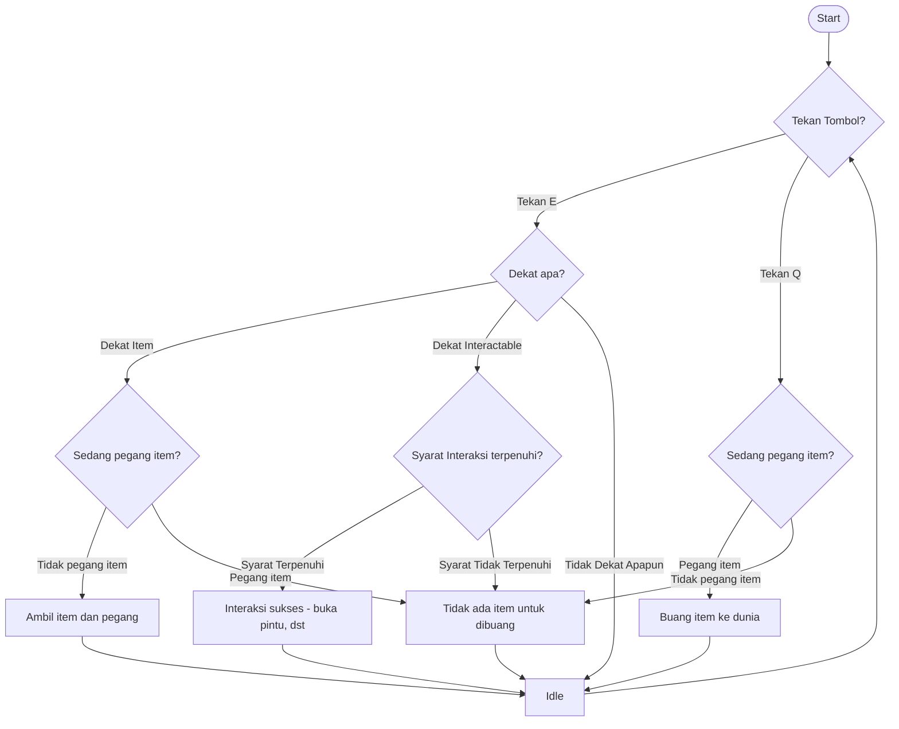
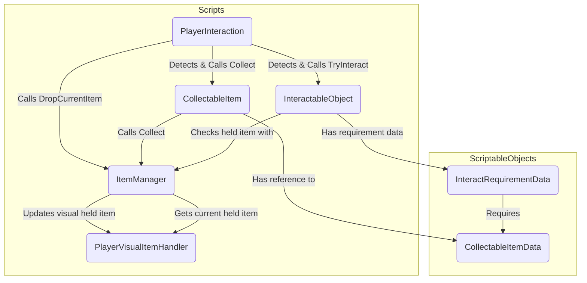

---
category:
  - "[[GameDevelopment]]"
tags:
  - 2025-W17
  - 2025-04-26
  - game_development
created: 2025-04-26 19:09
---

```mermaid
flowchart TD

    A[Player masuk ke Trigger Collider] --> B{Object apa?}

    B -->|CollectableItem| C[Set currentCollectableItem]

    B -->|InteractableObject| D[Set currentInteractable]

  

    C --> E{Tekan tombol E?}

    D --> E

  

    E -->|Ya| F{Sedang memegang item?}

    F -->|Tidak| G[Collect item dan pasang ke tangan drop]

    F -->|Ya| H[Tampilkan pesan 'Sudah memegang item']

  

    E -->|Tidak| I[Menunggu input lain]

  

    G --> J{Tekan tombol Q?}

    H --> J

    I --> J

  

    J -->|Ya| K{Sedang memegang item?}

    K -->|Ya| L[Lepas item dari tangan drop]

    K -->|Tidak| M[Tidak terjadi apa-apa]

  

    J -->|Tidak| N[Menunggu input lain]

  

    L --> O{Keluar dari Trigger Collider?}

    M --> O

    N --> O

  

    O -->|Ya| P[Clear currentCollectableItem/currentInteractable]

    O -->|Tidak| Q[Menunggu input lagi]

```

```mermaid
flowchart TD

    Start([Start]) --> CheckInput{Tekan Tombol?}

    CheckInput -->|Tekan E| CheckNearbyObject{Dekat apa?}

    CheckInput -->|Tekan Q| CheckHoldingItem{Sedang pegang item?}

  

    CheckNearbyObject -->|Dekat Item| CheckHoldingItemPick{Sedang pegang item?}

    CheckNearbyObject -->|Dekat Interactable| CheckRequirement{Syarat Interaksi terpenuhi?}

    CheckNearbyObject -->|Tidak Dekat Apapun| Idle

  

    CheckHoldingItemPick -->|Tidak pegang item| PickItem[Ambil item dan pegang]

    CheckHoldingItemPick -->|Pegang item| ShowMessage["Sudah pegang item lain.\nTekan Q untuk buang"]

  

    CheckRequirement -->|Syarat Terpenuhi| ExecuteInteraction[Interaksi sukses - buka pintu, dst]

    CheckRequirement -->|Syarat Tidak Terpenuhi| ShowMessage["Item tidak cocok untuk interaksi"]

  

    CheckHoldingItem -->|Pegang item| DropItem[Buang item ke dunia]

    CheckHoldingItem -->|Tidak pegang item| ShowMessage["Tidak ada item untuk dibuang"]

  

    PickItem --> Idle

    DropItem --> Idle

    ExecuteInteraction --> Idle

    ShowMessage --> Idle

    Idle --> CheckInput
```

```mermaid
flowchart TD

    %% Grouping

    subgraph ScriptableObjects

        SO1(CollectableItemData)

        SO2(InteractRequirementData)

    end

  

    subgraph Scripts

        S1(PlayerInteraction)

        S2(CollectableItem)

        S3(ItemManager)

        S4(PlayerVisualItemHandler)

        S5(InteractableObject)

    end

  

    %% Connections

    S1 -->|Detects & Calls Collect| S2

    S1 -->|Detects & Calls TryInteract| S5

    S1 -->|Calls DropCurrentItem| S3

  

    S2 -->|Has reference to| SO1

    S2 -->|Calls Collect| S3

  

    S5 -->|Has requirement data| SO2

    S5 -->|Checks held item with| S3

  

    S3 -->|Updates visual held item| S4

    S3 -->|Gets current held item| S4

  

    SO2 -->|Requires| SO1
```
