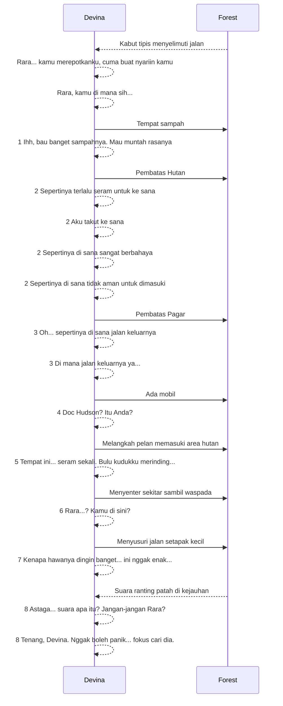
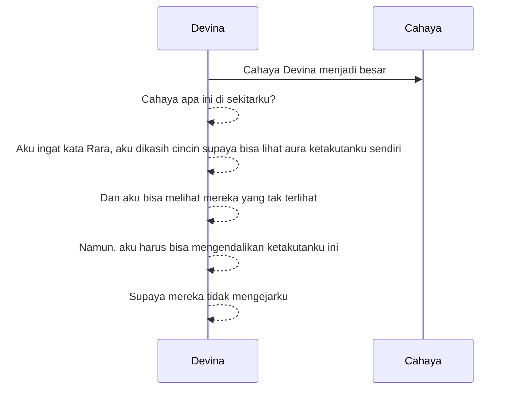
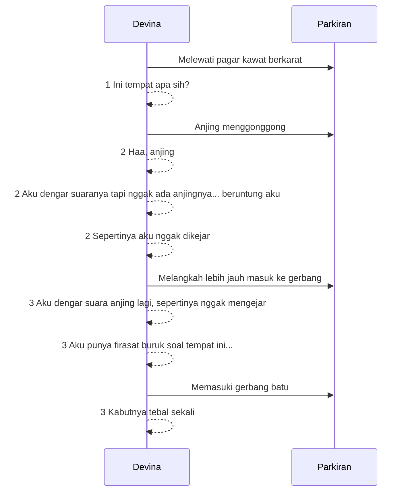
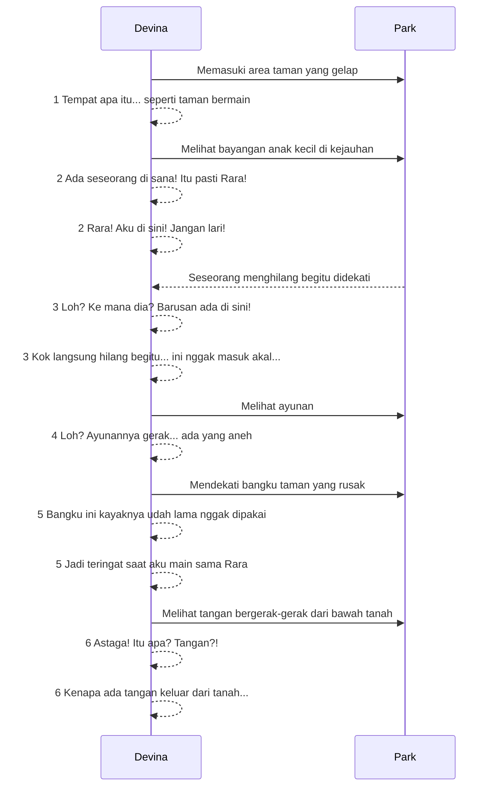
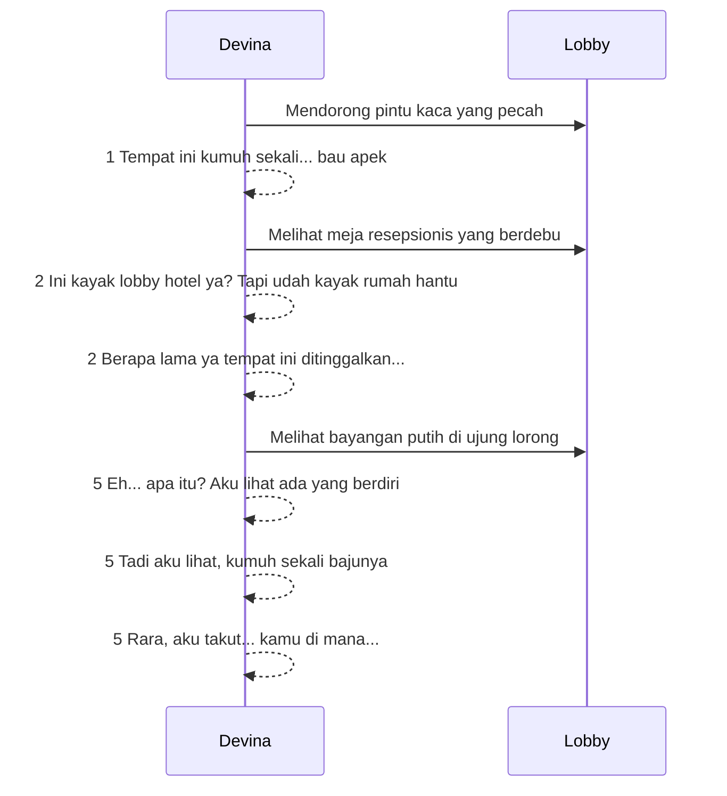
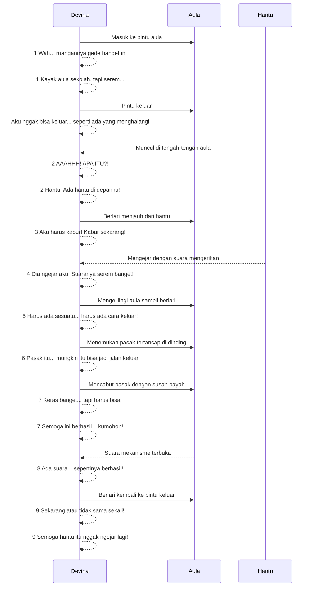
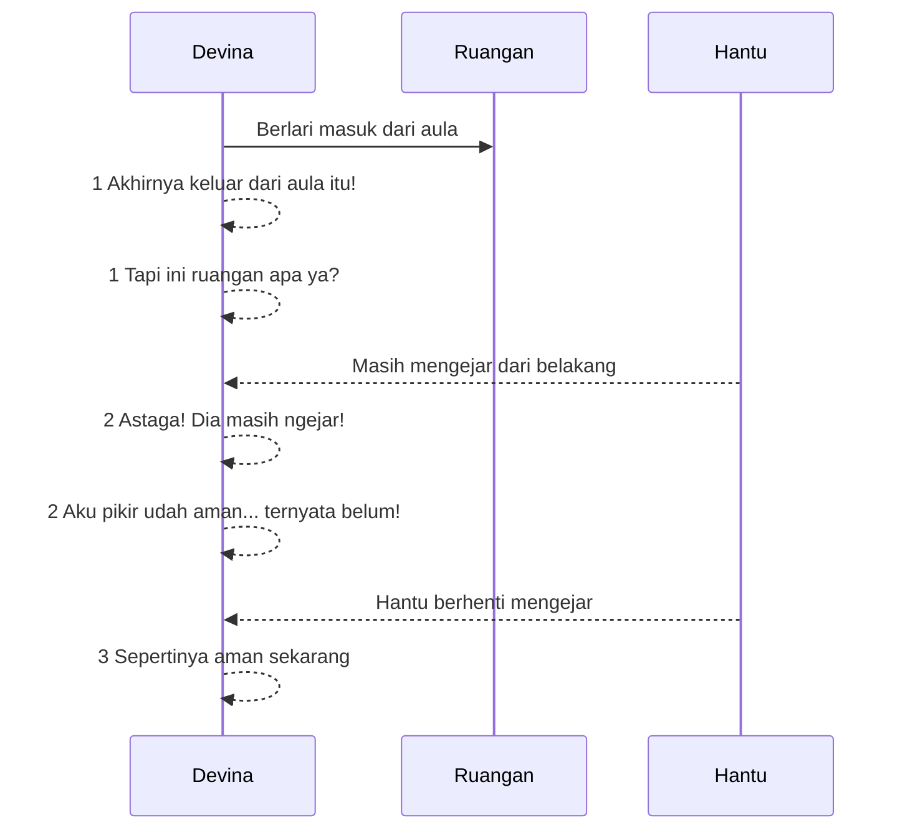
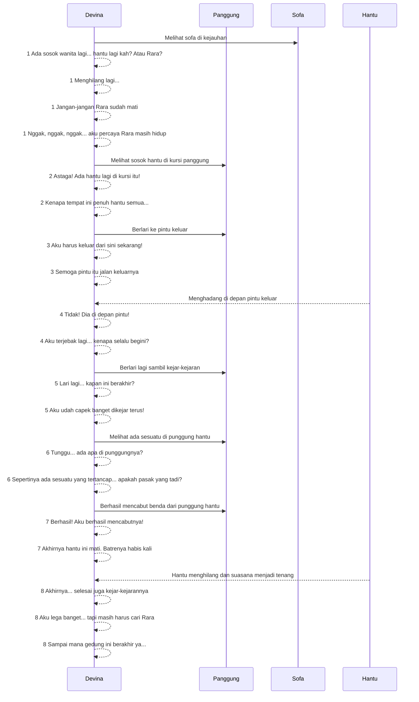
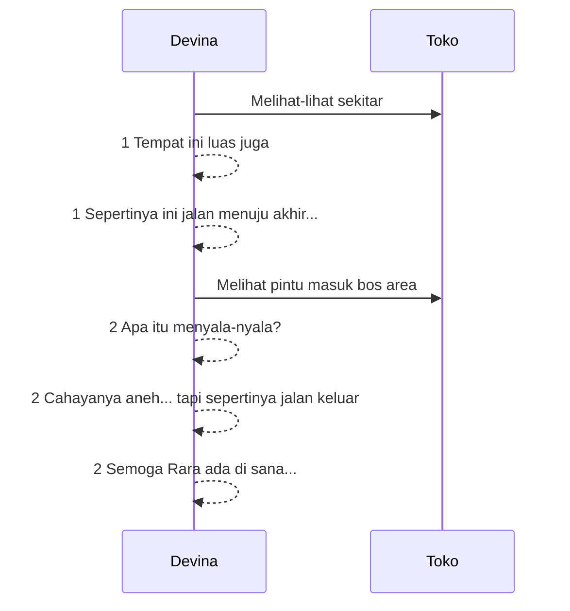
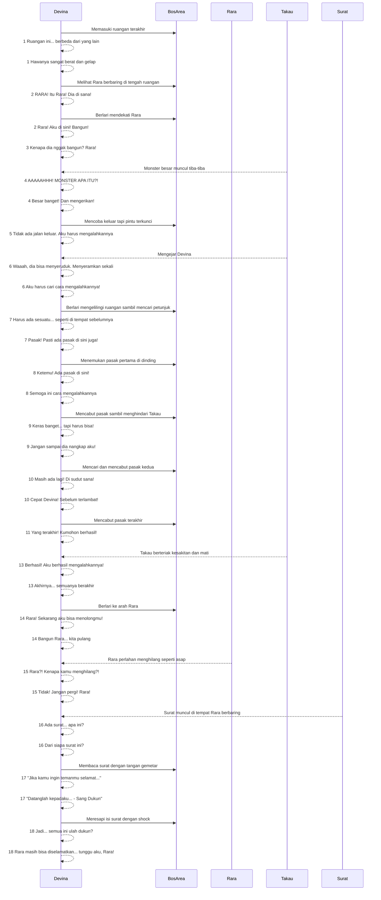

---
category:
  - GameDevelopment
tags:
  - 2025-W12
  - 2025-03-21
  - game_development
created:
  - 2025-03-21 20:08
---
# Forest (Halte)

# Cahaya

# Parking

# Park

# Lobby Gedung Tua

# Aula

# Ruangan setelah aula

# Panggung

# Toko

# Bos Area
